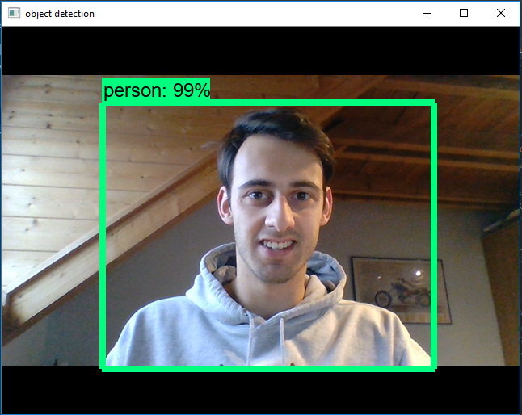
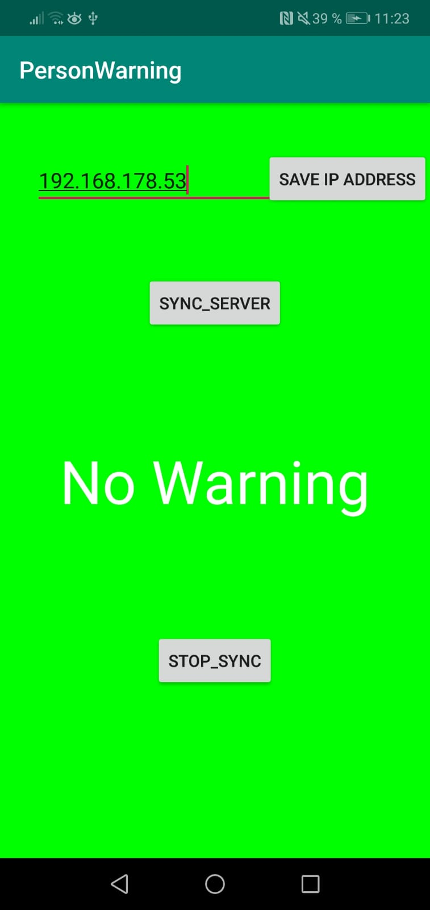
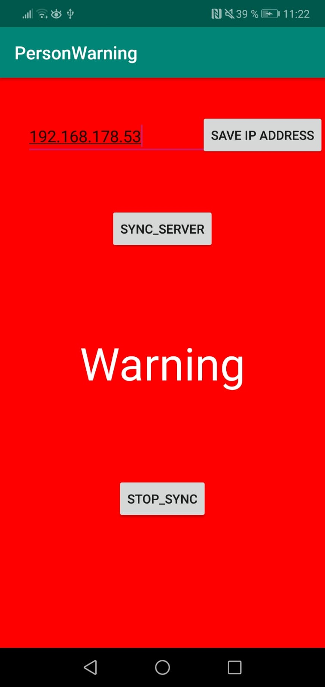

# object_detection_server
This project contains a python server, which is running the object detection and an Android APP that receives a warning
if the Object detection recognizes a Person.

## Getting Started
Just clone the repository and follow the instructions in the steps_fpr_python_setupt.txt for the right python configuration  
After that you have to download the Object Detection graph from http://download.tensorflow.org/models/object_detection/ssd_mobilenet_v1_coco_11_06_2017.tar.gz
and add it to the PyCharmServer folder.

###Android APP
Just open the android studio project with android studio -> Build the apk and put it on your mobile phone.

###Server
In the server project, you need to: 
-Adjust the IP adresss to the current ip adress in server.py: server_address = ('#IPADRESS', 8010) 
-In videoModule.py is the object detection logic and the HTTPServer_Request Handler: 
--> Adjust the path to the Tensorflow Object Detection API, which is needed for the Object Detection Part (https://github.com/tensorflow/models/tree/master/research/object_detection)
"Speed/accuracy trade-offs for modern convolutional object detectors."
Huang J, Rathod V, Sun C, Zhu M, Korattikara A, Fathi A, Fischer I, Wojna Z,
Song Y, Guadarrama S, Murphy K, CVPR 2017  
--> adjust the paths in the First lines of the --init-- method of the VideoProcessor CLass to the object detection model  
- Adjust this line in the VideoProcessor class: "self.cap = cv2.VideoCapture(0)" if you are using an external usb webcam. 
 

##How to run the applications

###Run the server.py file  

  

###Open the andriod app

  

Connect to the same network if the server is running on a private and local ip adress. Press the Save Button and CLick on Sync_Server to 
poll for updates, if the object detection is detecting a person.  

  

